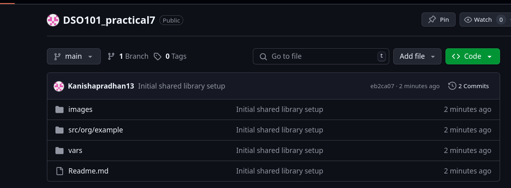

# Practical 7: Creating shared library in Jenkins

## Step 1: Create the Shared Library Repository Structure

## Step 2: Create the Shared Library Files

## Step 3: Push to a Git Repository

## Step 4: Configure Jenkins to Use the Shared Library

## Step 5: Use the Shared Library in Your Projects

